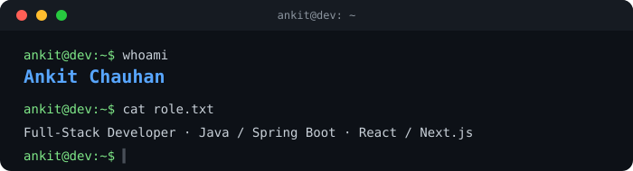

 

 

*Thanks for stopping by — hope your day's going well* 🌿

 

 

## 🧑‍💻 About Me

Full-stack developer building products across web and cloud. Currently working on **Redact AI** (a document redaction platform for healthcare) and **Nexus for Tableau** at Sproutlogix.

<table>
<tr>
<td width="50%" valign="top">

**Currently**
- 💼 Full-stack developer @ Sproutlogix
- 🛠️ Building Redact AI & Nexus for Tableau
- 🌱 Exploring Kafka, EKS/Karpenter, LLM prompt engineering

</td>
<td width="50%" valign="top">

**Background**
- 🎓 MSc Advanced Computer Science (Data Science)
- 🏫 University of Strathclyde
- 📍 Based in Glasgow, Scotland

</td>
</tr>
</table>

 

## 🛠️ Tech Stack

### Languages & Frameworks

 **Java** &nbsp;&nbsp;&nbsp;
 **Spring Boot** &nbsp;&nbsp;&nbsp;
 **TypeScript** &nbsp;&nbsp;&nbsp;
 **React** &nbsp;&nbsp;&nbsp;
 **Next.js** &nbsp;&nbsp;&nbsp;
 **Node.js**

### Data & Messaging

 **PostgreSQL** &nbsp;&nbsp;&nbsp;
 **MongoDB** &nbsp;&nbsp;&nbsp;
 **Kafka**

### Cloud & DevOps

 **AWS** &nbsp;&nbsp;&nbsp;
 **Docker**

 

## 📊 GitHub Stats

 

## 📫 Let's Connect

  

  

*Wishing you a calm, productive day ahead* ✨

